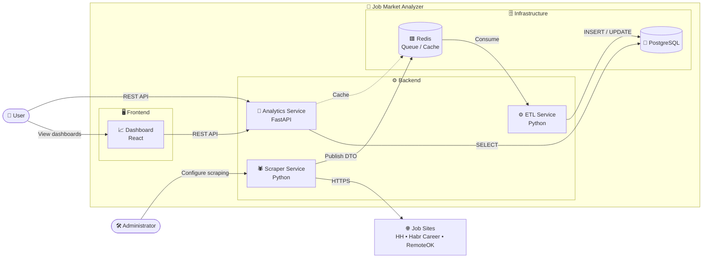

# C2 Container

```mermaid
flowchart LR

%% ============================================================
%% External Actors
%% ============================================================

user(["👤 User"])
admin(["🛠️ Administrator"])

sites["🌐 Job Sites<br/>HH • Habr Career • RemoteOK"]

%% ============================================================
%% Job Market Analyzer
%% ============================================================

subgraph system["🏢 Job Market Analyzer"]

    direction LR

    %% ---------- Frontend ----------
    subgraph frontend["🖥️ Frontend"]
        dashboard["📈 Dashboard<br/>React"]
    end

    %% ---------- Backend ----------
    subgraph backend["⚙️ Backend"]

        analytics["🚀 Analytics Service<br/>FastAPI"]

        scraper["🕷️ Scraper Service<br/>Python"]

        etl["⚙️ ETL Service<br/>Python"]

    end

    %% ---------- Infrastructure ----------
    subgraph infrastructure["🗄️ Infrastructure"]

        redis[("🟥 Redis<br/>Queue / Cache")]

        postgres[("🐘 PostgreSQL")]

    end

end

%% ============================================================
%% User interactions
%% ============================================================

user -->|"View dashboards"| dashboard
user -->|"REST API"| analytics

admin -->|"Configure scraping"| scraper

%% ============================================================
%% Internal communication
%% ============================================================

dashboard -->|"REST API"| analytics

scraper -->|"HTTPS"| sites
scraper -->|"Publish DTO"| redis

redis -->|"Consume"| etl

etl -->|"INSERT / UPDATE"| postgres

analytics -->|"SELECT"| postgres
analytics -.->|"Cache"| redis

%% ============================================================
%% Styles
%% ============================================================

class user,admin actor

class dashboard dashboard

class scraper,etl,analytics service

class postgres database

class redis cache

class sites external
```