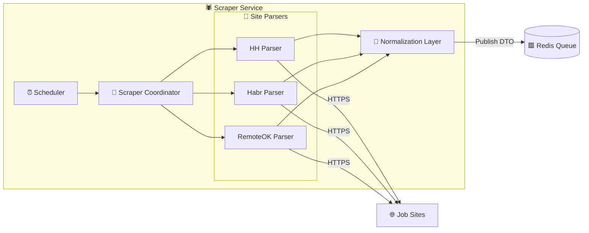
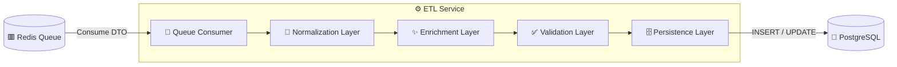
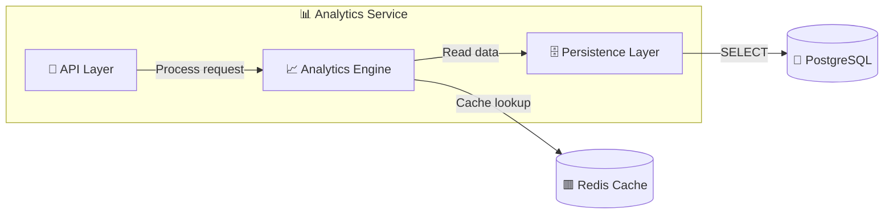

# C3 - Scraper Service

```mermaid
flowchart LR

sites["🌐 Job Sites"]

redis[("🟥 Redis Queue")]

subgraph scraper["🕷️ Scraper Service"]

    direction TB

    scheduler["⏰ Scheduler"]

    coordinator["🎯 Scraper Coordinator"]

    subgraph parsers["📄 Site Parsers"]

        hh["HH Parser"]

        habr["Habr Parser"]

        remote["RemoteOK Parser"]

    end

    normalize["🧩 Normalization Layer"]

end

scheduler --> coordinator

coordinator --> hh
coordinator --> habr
coordinator --> remote

hh -->|"HTTPS"| sites
habr -->|"HTTPS"| sites
remote -->|"HTTPS"| sites

hh --> normalize
habr --> normalize
remote --> normalize

normalize -->|"Publish DTO"| redis

class scheduler,coordinator,hh,habr,remote,normalize service

class redis cache

class sites external
```

# C3 - ETL Service

```mermaid
flowchart LR

redis[("🟥 Redis Queue")]

postgres[("🐘 PostgreSQL")]

subgraph etl["⚙️ ETL Service"]

    direction LR

    consumer["📨 Queue Consumer"]

    normalize["🧩 Normalization Layer"]

    enrich["✨ Enrichment Layer"]

    validate["✅ Validation Layer"]

    persistence["🗄️ Persistence Layer"]

end

redis -->|"Consume DTO"| consumer

consumer --> normalize

normalize --> enrich

enrich --> validate

validate --> persistence

persistence -->|"INSERT / UPDATE"| postgres

class consumer,normalize,enrich,validate,persistence service

class postgres database

class redis cache
```

# C3 - Analytics Service

```mermaid
flowchart LR

postgres[("🐘 PostgreSQL")]
redis[("🟥 Redis Cache")]

subgraph analytics["📊 Analytics Service"]

    direction LR

    api["🚀 API Layer"]

    engine["📈 Analytics Engine"]

    persistence["🗄️ Persistence Layer"]

end

api -->|"Process request"| engine

engine -->|"Cache lookup"| redis

engine -->|"Read data"| persistence

persistence -->|"SELECT"| postgres

class api,engine,persistence service
class postgres database
class redis cache
```