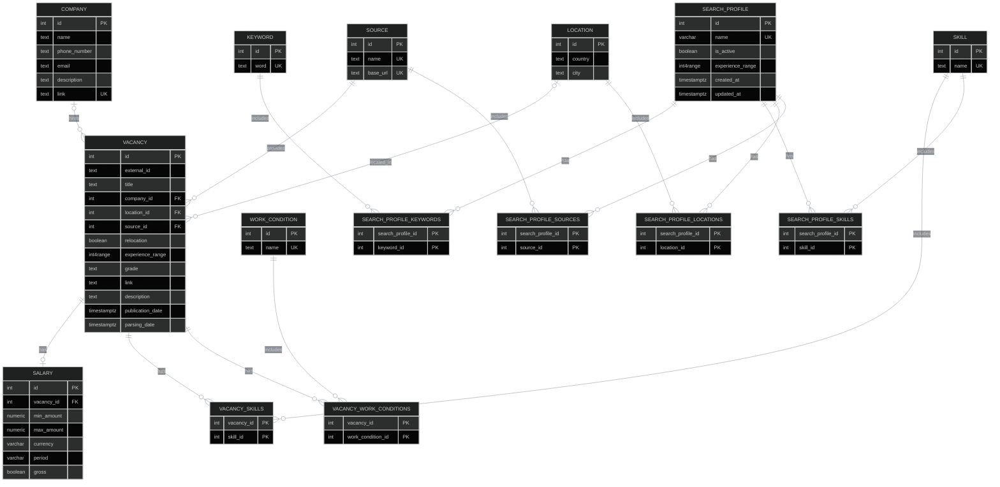

# ER - diagram

```mermaid
%%{
init: {
  "theme": "dark",
  "themeVariables": {
    "background": "#0D1117",
    "primaryColor": "#161B22",
    "primaryBorderColor": "#58A6FF",
    "primaryTextColor": "#F0F6FC",
    "secondaryColor": "#21262D",
    "secondaryBorderColor": "#7EE787",
    "secondaryTextColor": "#F0F6FC",
    "tertiaryColor": "#1F2937",
    "tertiaryBorderColor": "#BC8CFF",
    "tertiaryTextColor": "#F0F6FC",
    "lineColor": "#8B949E",
    "fontFamily": "Inter, Segoe UI, Arial",
    "fontSize": "15px"
  }
}
}%%

erDiagram
    SOURCE ||--o{ VACANCY : provides
    COMPANY o|--o{ VACANCY : hires
    LOCATION o|--o{ VACANCY : located_in
    VACANCY ||--o| SALARY : has
    VACANCY ||--o{ VACANCY_SKILLS : has
    SKILL ||--o{ VACANCY_SKILLS : includes
    VACANCY ||--o{ VACANCY_WORK_CONDITIONS : has
    WORK_CONDITION ||--o{ VACANCY_WORK_CONDITIONS : includes
    SEARCH_PROFILE ||--o{ SEARCH_PROFILE_KEYWORDS : has
    KEYWORD ||--o{ SEARCH_PROFILE_KEYWORDS : includes
    SEARCH_PROFILE ||--o{ SEARCH_PROFILE_SKILLS : has
    SKILL ||--o{ SEARCH_PROFILE_SKILLS : includes
    SEARCH_PROFILE ||--o{ SEARCH_PROFILE_LOCATIONS : has
    LOCATION ||--o{ SEARCH_PROFILE_LOCATIONS : includes
    SEARCH_PROFILE ||--o{ SEARCH_PROFILE_SOURCES : has
    SOURCE ||--o{ SEARCH_PROFILE_SOURCES : includes

    SOURCE {
        int id PK
        text name UK
        text base_url UK
    }
    COMPANY {
        int id PK
        text name
        text phone_number
        text email
        text description
        text link UK
    }
    LOCATION {
        int id PK
        text country
        text city
    }
    VACANCY {
        int id PK
        text external_id
        text title
        int company_id FK
        int location_id FK
        int source_id FK
        boolean relocation
        int4range experience_range
        text grade
        text link
        text description
        timestamptz publication_date
        timestamptz parsing_date
    }
    SALARY {
        int id PK
        int vacancy_id FK
        numeric min_amount
        numeric max_amount
        varchar currency
        varchar period
        boolean gross
    }
    SKILL {
        int id PK
        text name UK
    }
    WORK_CONDITION {
        int id PK
        text name UK
    }
    KEYWORD {
        int id PK
        text word UK
    }
    SEARCH_PROFILE {
        int id PK
        varchar name UK
        boolean is_active
        int4range experience_range
        timestamptz created_at
        timestamptz updated_at
    }
    VACANCY_SKILLS {
        int vacancy_id PK
        int skill_id PK
    }
    VACANCY_WORK_CONDITIONS {
        int vacancy_id PK
        int work_condition_id PK
    }
    SEARCH_PROFILE_KEYWORDS {
        int search_profile_id PK
        int keyword_id PK
    }
    SEARCH_PROFILE_SKILLS {
        int search_profile_id PK
        int skill_id PK
    }
    SEARCH_PROFILE_LOCATIONS {
        int search_profile_id PK
        int location_id PK
    }
    SEARCH_PROFILE_SOURCES {
        int search_profile_id PK
        int source_id PK
    }
```
